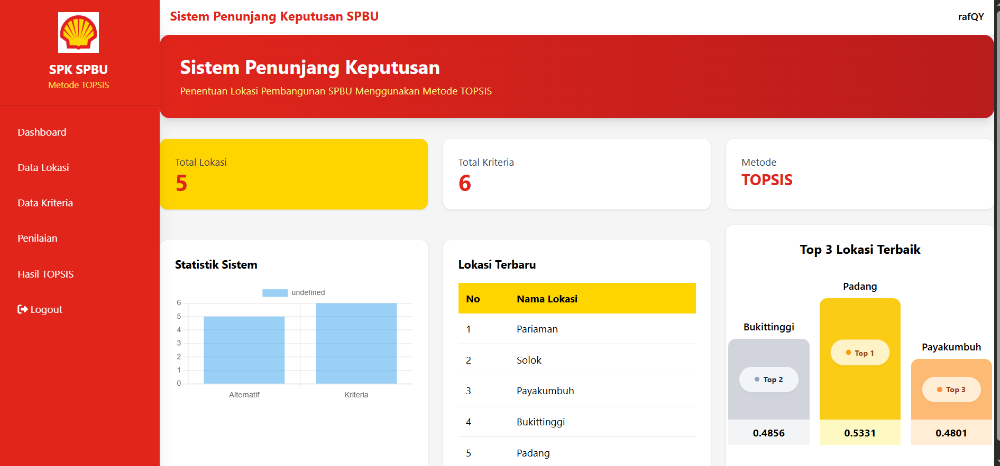
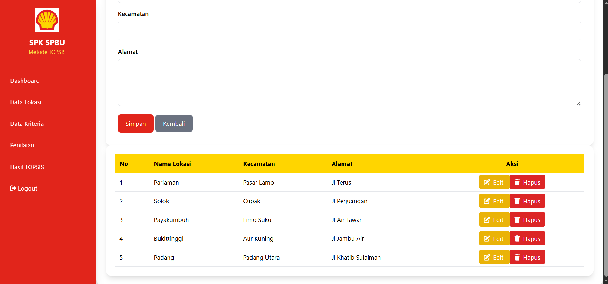
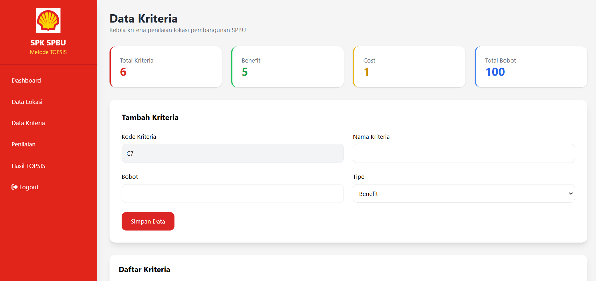
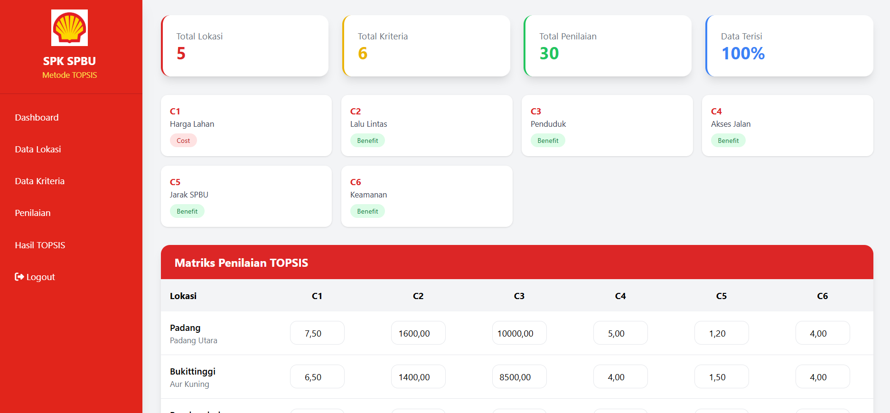
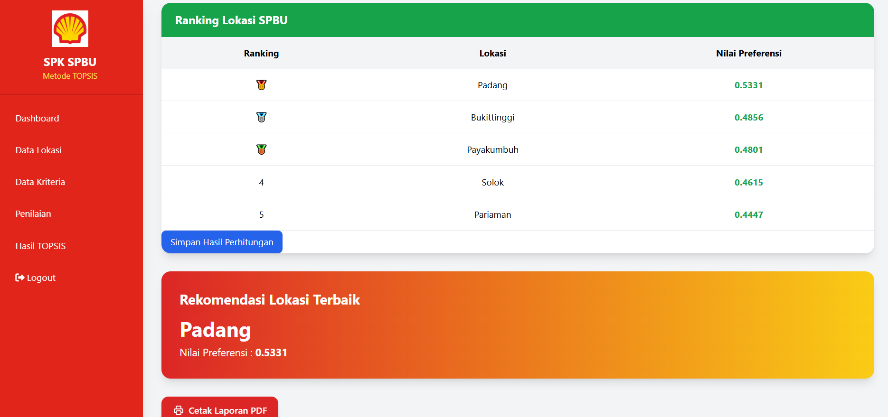

# 🚀 Sistem Penunjang Keputusan Penentuan Lokasi Pembangunan SPBU Menggunakan Metode TOPSIS

## 📌 Deskripsi

Sistem Penunjang Keputusan (SPK) berbasis web yang dikembangkan untuk membantu proses pengambilan keputusan dalam menentukan lokasi pembangunan SPBU terbaik menggunakan metode **TOPSIS (Technique for Order Preference by Similarity to Ideal Solution)**.

Sistem ini mampu mengelola data alternatif lokasi, data kriteria, data penilaian, melakukan perhitungan TOPSIS secara otomatis, menampilkan hasil ranking, serta menghasilkan laporan dalam format PDF.

---

## 🎯 Tujuan

Membantu pengambil keputusan dalam menentukan lokasi pembangunan SPBU berdasarkan beberapa kriteria penilaian sehingga menghasilkan keputusan yang lebih objektif, cepat, dan akurat.

---

## 🛠️ Teknologi yang Digunakan

* PHP Native
* MySQL Database
* Tailwind CSS
* JavaScript
* Font Awesome
* Dompdf
* XAMPP
* Visual Studio Code

---

## ⚙️ Metode Pengambilan Keputusan

Metode yang digunakan pada sistem ini adalah:

### TOPSIS (Technique for Order Preference by Similarity to Ideal Solution)

Tahapan yang diimplementasikan:

1. Matriks Keputusan
2. Normalisasi Matriks
3. Normalisasi Terbobot
4. Solusi Ideal Positif (A+)
5. Solusi Ideal Negatif (A-)
6. Jarak Solusi Ideal Positif (D+)
7. Jarak Solusi Ideal Negatif (D-)
8. Nilai Preferensi (V)
9. Ranking Alternatif

---

## ✨ Fitur Sistem

### 🔐 Login Administrator

* Autentikasi pengguna
* Session Login
* Logout

### 📊 Dashboard

* Statistik Data Lokasi
* Statistik Kriteria
* Statistik Penilaian
* Informasi Sistem

### 📍 Data Lokasi (Alternatif)

* Tambah Lokasi
* Edit Lokasi
* Hapus Lokasi
* Daftar Lokasi SPBU

### 📋 Data Kriteria

* Tambah Kriteria
* Edit Kriteria
* Hapus Kriteria
* Pengaturan Bobot dan Tipe Kriteria

### 📝 Data Penilaian

* Input Nilai Alternatif
* Edit Penilaian
* Hapus Penilaian

### 🧮 Perhitungan TOPSIS

* Matriks Keputusan
* Matriks Normalisasi
* Matriks Terbobot
* Solusi Ideal Positif dan Negatif
* Perhitungan Jarak
* Nilai Preferensi

### 🏆 Hasil Ranking

* Ranking Alternatif
* Rekomendasi Lokasi Terbaik

### 📄 Export PDF

* Cetak Hasil Perhitungan TOPSIS
* Cetak Ranking Alternatif

---

## 📸 Tampilan Sistem

### Login


### Dashboard



### Data Lokasi



### Data Kriteria



### Data Penilaian



### Hasil Perhitungan TOPSIS



---

## 🗄️ Struktur Database

### Tabel Users

| Field        | Keterangan   |
| ------------ | ------------ |
| id           | ID User      |
| username     | Username     |
| password     | Password     |
| nama_lengkap | Nama Lengkap |

### Tabel Alternatif

| Field         | Keterangan  |
| ------------- | ----------- |
| id_alternatif | ID Lokasi   |
| nama_lokasi   | Nama Lokasi |
| kecamatan     | Kecamatan   |
| alamat        | Alamat      |

### Tabel Kriteria

| Field         | Keterangan     |
| ------------- | -------------- |
| id_kriteria   | ID Kriteria    |
| kode_kriteria | Kode Kriteria  |
| nama_kriteria | Nama Kriteria  |
| bobot         | Bobot          |
| tipe          | Benefit / Cost |

### Tabel Penilaian

| Field         | Keterangan   |
| ------------- | ------------ |
| id_penilaian  | ID Penilaian |
| id_alternatif | Alternatif   |
| id_kriteria   | Kriteria     |
| nilai         | Nilai        |

---

## 📂 Struktur Project

```text
spk-spbu/
│
├── assets/
├── auth/
├── config/
├── template/
├── alternatif/
├── kriteria/
├── penilaian/
├── topsis/
├── dashboard.php
└── README.md
```

## 🚀 Cara Menjalankan Project

### 1. Clone Repository

```bash
git clone https://github.com/username/spk-spbu.git
```

### 2. Pindahkan ke Folder htdocs

```text
C:\xampp\htdocs\spk-spbu
```

### 3. Import Database

* Buka phpMyAdmin
* Buat database `spk_spbu`
* Import file SQL yang tersedia

### 4. Jalankan XAMPP

Aktifkan:

* Apache
* MySQL

### 5. Akses Aplikasi

```text
http://localhost/spk-spbu
```

---

## 👨‍🎓 Informasi Pengembang

**Nama:** [M.Rafqy Pratama]

**Program Studi:** Sistem Informasi

**Universitas:** Universitas Metamedia

**Tahun:** 2026

---

## 📜 Lisensi

Project ini dikembangkan untuk keperluan Tugas Akhir dan pembelajaran akademik.
